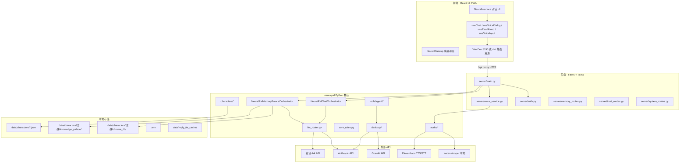
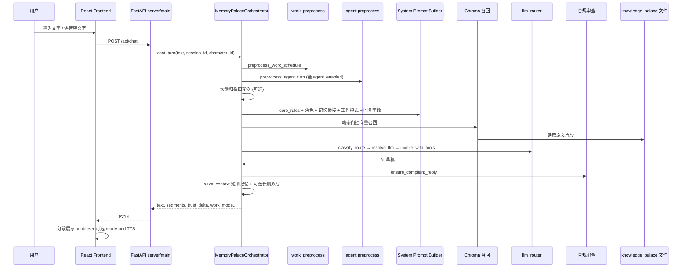
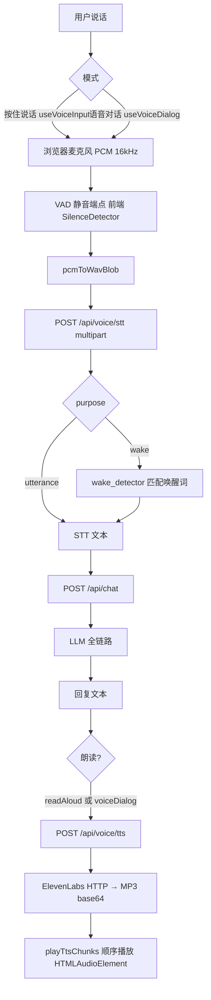
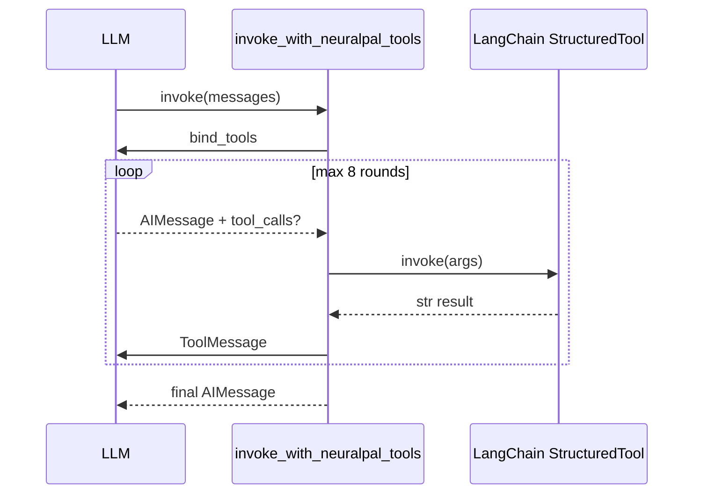
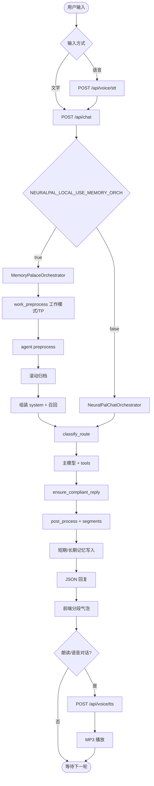

# 贾维斯（Neural Pal）AI Agent 技术审计报告

> 审计范围：`/Users/dai/Desktop/贾维斯` 仓库全部源码与配置（不含 `node_modules/`、`.venv/` 第三方包实现细节）。  
> 审计日期：2026-06-21  
> 用途：供外部 AI（如 GPT-5.5）完整理解本项目架构与能力边界。

---

# 1. Project Overview

## 项目名称

- **仓库名 / npm 包名**：`neural-pal-wakeup`（`package.json`）
- **产品名**：贾维斯 · 沈昼（PWA manifest：`贾维斯 · 沈昼`）
- **后端标题**：`贾维斯 Neural Pal Chat`（`server/main.py` FastAPI title）
- **Python 包名**：`neuralpal`（从「百事通」项目迁移并扩展）

## 一句话介绍

本地优先的 AI 数字伴侣 Web/PWA 应用：以角色「沈昼」（INTJ 总裁高级特助）为核心，提供唤醒动画、文字/语音对话、记忆宫殿、信任度（亲密度）、工作模式、本机/网页代办（Computer Use）与 macOS 桌面 App 打包能力。

## 项目用途

1. **用户侧**：登录后观看 Neural 唤醒动画，与沈昼进行陪伴式或工作式对话；可选语音输入、语音对话、文字朗读。
2. **记忆侧**：按「记忆宫殿」四层架构持久化规则、短期/中期/长期记忆，Chroma 向量召回。
3. **代办侧**：在 macOS 上经用户确认后，代操本机（Claude Computer Use + pyautogui）或网页（OpenAI computer-use-preview）。
4. **运营侧**：管理者可查看/维护记忆、调整信任度（TP）；支持 PWA 安装、Git 更新检测、macOS `.app` 打包。

## 整体架构图（Mermaid）



## 项目目录树（核心部分，省略 node_modules / .venv / dist 构建产物）

```
贾维斯/
├── AI_Agent_Audit_Report.md          # 本报告
├── package.json                      # 前端依赖与脚本
├── requirements.txt                  # Python 依赖
├── vite.config.ts                    # Vite + PWA + API 代理
├── .env.example                      # 环境变量模板
├── README.md                         # 唤醒动画项目说明（部分过时）
├── scripts/
│   ├── run_jarvis.sh                 # 一键启动前后端
│   ├── run_backend.sh                # 仅后端
│   └── macos/                        # py2app、权限、App 图标
├── server/
│   ├── main.py                       # FastAPI 主入口、/api/chat、/api/voice/*
│   ├── voice_service.py              # STT/TTS 服务封装
│   ├── auth.py                       # 登录校验
│   ├── memory_routes.py              # 记忆宫殿管理 API
│   ├── trust_routes.py               # 信任度 API
│   └── system_routes.py              # 版本/更新/权限 API
├── neuralpal/                        # AI 核心（从百事通迁移）
│   ├── core_rules.py                 # 系统规则层（只读 SYSTEM_PROMPT）
│   ├── config/settings.py            # 全部配置（pydantic-settings）
│   ├── llm/llm_router.py             # 路由、合规、主对话编排
│   ├── memory/                       # 记忆宫殿编排与 Chroma
│   ├── characters/                   # 角色、信任度、prompt 桥接
│   ├── chat/                         # 回复格式、纯文本、签名
│   ├── audio/                        # STT/TTS/VAD/唤醒词（含 PySide6 桌面版控制器）
│   ├── tools/agent/                  # 代办工具与状态机
│   ├── tools/reminder/               # 提醒插件（占位）
│   ├── desktop/                      # Computer Use 执行器
│   ├── schedule/                     # 工作模式、加班状态
│   ├── system/                       # App 更新、macOS 权限
│   ├── companion_life/               # 伴侣生活（部分模块，无 bridge）
│   └── topic_radar/                  # 话题雷达（仅 config/models，无 bridge）
├── data/
│   ├── characters/
│   │   ├── characters.json           # 角色定义（沈昼）
│   │   ├── session_bindings.json
│   │   └── 沈昼/
│   │       ├── knowledge_palace/       # 记忆宫殿文件
│   │       ├── chroma_db/             # 长期向量库
│   │       └── rules/                  # 信任度、回复风格
│   ├── auth_users.json
│   └── agent_sessions/
├── src/                              # React 前端
│   ├── app/App.tsx
│   ├── components/boot/              # 唤醒、对话 UI
│   ├── components/admin/             # 沈昼管理面板
│   ├── components/system/            # 权限、更新弹窗
│   ├── hooks/                        # 对话、语音、信任度等
│   └── lib/                          # API 客户端、PCM 音频
└── tests/                            # 语音、代办、路由等测试
```

## 每个目录作用

| 目录 | 作用 |
|------|------|
| `server/` | HTTP API 层，连接前端与 `neuralpal` |
| `neuralpal/` | AI Agent 全部业务逻辑 |
| `neuralpal/llm/` | LLM 工厂、路由分类、合规审查、基础编排器 |
| `neuralpal/memory/` | 四层记忆、Chroma 召回、维护、管理后台服务 |
| `neuralpal/characters/` | 角色 JSON、MBTI、信任度、system prompt 注入 |
| `neuralpal/audio/` | 语音 STT/TTS 适配器；桌面版 `VoiceDialogController`（PySide6） |
| `neuralpal/tools/agent/` | LangChain 代办工具 + 确认/执行状态机 |
| `neuralpal/desktop/` | macOS 本机/网页任务执行 |
| `src/` | React PWA UI |
| `data/` | 运行时持久化数据（角色、记忆、会话） |
| `scripts/` | 启动、打包、权限脚本 |

## 每个重要文件作用

| 文件 | 作用 |
|------|------|
| `server/main.py` | 主 API：`/api/chat`、`/api/voice/*`、`/api/login`、agent 确认/取消；按 `JARVIS_APP_MODE` 可提供 SPA |
| `neuralpal/llm/llm_router.py` | `NeuralPalChatOrchestrator.chat_turn`、模型路由、合规闭环 |
| `neuralpal/memory/memory_system.py` | `NeuralPalMemoryPalaceOrchestrator.chat_turn`（默认启用） |
| `neuralpal/core_rules.py` | `get_system_prompt()`、`validate_before_generation()` |
| `neuralpal/characters/prompt_bridge.py` | 角色人格注入 `build_character_system_addon()` |
| `server/voice_service.py` | Web 端语音 API 后端实现 |
| `src/hooks/useChatWithVoice.ts` | 聚合文字聊天 + 朗读 + 语音对话 + 按住说话 |
| `vite.config.ts` | 端口 5190，`/api` → `127.0.0.1:8766` |

---

# 2. Tech Stack

## Frontend

| 项 | 版本/技术 | 来源 |
|----|-----------|------|
| 框架 | React `^19.2.6` | `package.json` |
| 构建 | Vite `^8.0.12` | `package.json` |
| 语言 | TypeScript `~6.0.2` | `package.json` |
| 样式 | Tailwind CSS `^4.3.1` | `package.json` |
| 动画 | Motion `^12.40.0`、Flubber `^0.4.2` | `package.json` |
| PWA | `vite-plugin-pwa` `^1.3.0` | `vite.config.ts` |
| 图标 | lucide-react `^1.21.0` | `package.json` |

## Backend

| 项 | 版本/技术 | 来源 |
|----|-----------|------|
| 框架 | FastAPI `>=0.115,<1` | `requirements.txt` |
| ASGI | uvicorn `>=0.30,<1` | `requirements.txt` |
| 上传 | python-multipart `>=0.0.9` | `requirements.txt` |
| 配置 | pydantic-settings `>=2.0,<3` | `requirements.txt` |
| Agent 框架 | LangChain `0.2.16`、langchain-core `0.2.43` | `requirements.txt` |
| LLM SDK | langchain-openai、langchain-anthropic、openai、anthropic | `requirements.txt` |

## Database

- **关系型数据库**：❌ 当前项目不存在该模块（无 PostgreSQL/MySQL/SQLite ORM 业务库）。
- **文件 JSON**：`data/characters/characters.json`、`data/auth_users.json`、`data/agent_sessions/*.json`
- **向量库**：ChromaDB `0.5.0`（`langchain-chroma==0.1.3`）
- **Markdown 文件库**：`knowledge_palace` 目录树

## Memory

- **编排**：`NeuralPalMemoryPalaceOrchestrator`（`neuralpal/memory/memory_system.py`）
- **嵌入模型**：`sentence-transformers/paraphrase-multilingual-MiniLM-L12-v2`（`chroma_embeddings.py`）
- **短期**：LangChain `ConversationBufferMemory` + `01_短期记忆/*.md`
- **中期/长期**：`02_中期记忆/`、`03_长期记忆/` + Chroma collection `neuralpal_long_term_memory`

## Agent Framework

- **LangChain 0.2.x**：`invoke_with_neuralpal_tools()` 工具循环（最多 8 轮，`langchain_bridge.py`）
- **编排器**：`NeuralPalChatOrchestrator`（无记忆）/ `NeuralPalMemoryPalaceOrchestrator`（有记忆，Web 默认）

## Prompt Framework

- **规则层**：`neuralpal/core_rules.py` → `get_system_prompt()`
- **角色层**：`prompt_bridge.build_character_system_addon()`
- **动态注入**：工作模式、回复字数、agent addon、记忆召回、合规上下文等

## Authentication

- **方式**：简单用户名密码（MVP），`POST /api/login`
- **实现**：`server/auth.py` — 环境变量 `JARVIS_AUTH_USER` / `JARVIS_AUTH_PASSWORD` + `data/auth_users.json`
- **会话**：前端 `useAuth` / `UserSessionContext`（localStorage，非 JWT）
- **角色权限**：`is_admin_username()` 控制记忆管理、TP 调整

## Storage

- 本地文件系统：`data/`、`knowledge_palace/`、Chroma 持久化目录
- TTS 磁盘缓存：`data/reply_tts_cache/`（`DiskAudioCache`）
- 前端：`localStorage`（朗读开关、会话等）

## Deployment

- **开发**：`./scripts/run_jarvis.sh dev` → 后端 8766 + Vite 5190
- **生产预览**：`./scripts/run_jarvis.sh prod` → build + preview
- **macOS App**：`scripts/macos/make_jarvis_app.sh`（py2app），`JARVIS_APP_MODE=1` 时后端同端口托管 `dist/`
- **Docker**：❌ 当前项目不存在该模块（无 Dockerfile）

## Container

❌ 当前项目不存在该模块

## Package Manager

- 前端：**npm**
- 后端：**pip** + `requirements.txt`，推荐 `python3 -m venv .venv`

## 所有依赖版本（项目声明）

### Python（`requirements.txt`）

```
langchain==0.2.16
langchain-core==0.2.43
langchain-openai>=0.1.20,<0.2
langchain-anthropic==0.1.23
openai>=1.30,<2
anthropic==0.89.0
python-dotenv==1.0.1
pydantic-settings>=2.0,<3
fastapi>=0.115,<1
uvicorn>=0.30,<1
python-multipart>=0.0.9,<1
certifi>=2024.0.0
pyautogui>=0.9.54,<1
pyperclip>=1.8,<2
Pillow>=10.0,<12
pyobjc-framework-ApplicationServices>=10.3 (darwin)
pyobjc-framework-Quartz>=10.3 (darwin)
webrtcvad>=2.0.10,<3
faster-whisper>=1.1.0,<2
langchain-chroma==0.1.3
langchain-community>=0.2,<0.3
chromadb==0.5.0
sentence-transformers>=3.3,<4
```

### Node（`package.json` 主要）

见第 2 节 Frontend 表；完整见 `package.json`。

## Node 版本

- 实测环境：`v22.16.0`（审计时 `node --version`）
- 代码中未锁定 `.nvmrc`；`package.json` 要求 `@types/node ^24.12.3`

## Python 版本

- 实测环境：`Python 3.13.7`（`.venv` 与系统 `python3`）
- `requirements.txt` 注释写 `python3.10`；代码未强制版本检查
- **注意**：`webrtcvad` 在 Python 3.13 下可能回退到能量 VAD（测试日志可见 fallback）

---

# 3. AI Architecture

## 数据流（文字对话 · 默认记忆编排器）



## 数据流（含语音 · Web 实现）



**说明**：STT 在服务端批量完成（整段 WAV），非流式；TTS 按 `TextChunker` 分句后逐 chunk 请求，前端顺序播放，非流式合成。

---

# 4. LLM Configuration

## 使用哪些模型

由 `NEURALPAL_LLM_PROVIDER` 切换（`settings.active_llm_provider`，默认代码默认值为 `claude`，`.env.example` 推荐 `doubao`）。

### Provider 列表（项目代码内实际使用）

| Provider | 用途 | 配置键 |
|----------|------|--------|
| **豆包 Doubao** | 主对话（general/deep/code/fast 路由） | `DOUBAO_*` |
| **Anthropic Claude** | 主对话（provider=claude 时）；合规审查 lite；Agent Computer Use；网页搜索 | `ANTHROPIC_*` |
| **OpenAI** | Agent 网页 Computer Use（`computer-use-preview`）；Whisper STT（可选） | `OPENAI_*` |
| **ElevenLabs** | TTS；STT Scribe（可选） | `ELEVENLABS_*` |
| **本地 faster-whisper** | 默认 STT（`NEURALPAL_VOICE_STT_PROVIDER=local`） | 无 API Key |

### ❌ 项目代码中不存在的 Provider

- **Google Gemini**：当前项目不存在该模块（仅第三方库内含 gemini 字样）
- **DeepSeek**：当前项目不存在该模块
- **Azure OpenAI**：当前项目不存在该模块

### 各模型用途与默认 ID

| 模型配置项 | 默认值 | 用途 |
|------------|--------|------|
| `DOUBAO_MODEL_PRO` | `doubao-seed-2-0-pro-260215` | 主对话 general |
| `DOUBAO_MODEL_LITE` | `doubao-seed-2-0-lite-260215` | 路由分类、合规 lite |
| `DOUBAO_MODEL_DEEP` | `doubao-seed-2-0-pro-260215` | deep 路由 |
| `DOUBAO_MODEL_CODE` | `doubao-seed-2-0-code-preview-260215` | code 路由 |
| `ANTHROPIC_MODEL_SONNET` | `claude-sonnet-4-6` | Claude 主模型 |
| `ANTHROPIC_MODEL_HAIKU` | `claude-haiku-4-5` | 轻量任务、合规 |
| `ANTHROPIC_MODEL_OPUS` | `claude-opus-4-6` | deep 路由（claude provider） |
| `NEURALPAL_AGENT_OPENAI_MODEL` | `computer-use-preview` | 网页代办 |
| `NEURALPAL_AGENT_CLAUDE_MODEL` | 空则用 SONNET | 本机 Computer Use |
| `ELEVENLABS_MODEL_ID` | `eleven_multilingual_v2` | TTS |
| `voice_stt_local_model` | `base` | faster-whisper |
| `voice_stt_model` (openai) | `whisper-1` | OpenAI STT |
| `voice_stt_model` (elevenlabs) | `scribe_v2` | ElevenLabs STT |

## 参数

| 参数 | 是否使用 | 值/说明 |
|------|----------|---------|
| **temperature** | ✅ | 路由：lite `0.0`；general `0.7`；deep `0.4`；code `0.2`；合规 `0.0~0.3`（见 `llm_router.py`） |
| **top_p** | ❌ | 代码中无法确认（未传入 ChatOpenAI / ChatAnthropic） |
| **max_tokens** | ✅ | Doubao：`DOUBAO_MAX_TOKENS` 默认 4096；Claude：`ANTHROPIC_MAX_TOKENS` 4096；lite 常用 256~2048 |
| **reasoning** | ❌ | 当前项目不存在该模块 |
| **stream** | ❌ | **显式 `streaming=False`**（`_make_chat_model`，Doubao）；Claude 工厂未开 stream |
| **json mode** | 部分 | 路由/合规使用 `with_structured_output(Pydantic)`，非 OpenAI JSON mode |
| **response format** | 部分 | 结构化输出：`RouteDecision`、`ComplianceReview` |

## System / Developer / User Prompt 位置

| 类型 | 位置 | 说明 |
|------|------|------|
| **System（规则层）** | `neuralpal/core_rules.py` → `SYSTEM_PROMPT` / `get_system_prompt()` | 固定只读，含完整性标记 `[[NEURALPAL_RULES_INTEGRITY_V1]]` |
| **System（角色）** | `neuralpal/characters/prompt_bridge.py` → `build_character_system_addon()` | 动态，按 `characters.json` |
| **System（角色规则）** | `data/characters/沈昼/rules/*.md`、`character_rules.py` | 信任档、回复风格 |
| **System（工作/字数）** | `schedule/work_preprocess.py`、`chat/reply_format.py` | 动态注入 |
| **System（Agent）** | `tools/agent/prompt_addon.py` | 有待办任务时注入 |
| **System（记忆召回）** | `memory_system._build_system_block()` | Chroma + 文件片段 |
| **Developer prompt** | ❌ | 无独立 OpenAI-style developer 角色；规则均并入 SystemMessage |
| **User** | 每轮 `HumanMessage(content=user_text)` | 经 agent/work 预处理后 |
| **历史** | `_history` 或 `_short.chat_memory` | 最近 N 轮 |

## Context Window

- 代码中**未显式配置** context window 上限。
- 实际控制手段：
  - `NEURALPAL_WORKING_MEMORY_MAX_ROUNDS`（默认 5 轮 = 10 条消息）
  - `NEURALPAL_WORKING_MEMORY_FULL_ROUNDS`（混合短期，默认 2 轮全文 + 更早摘要）
  - 长期召回 topK、动态相似度阈值 `NEURALPAL_RETRIEVAL_SIMILARITY_THRESHOLD`（0.65）
  - 合规/路由使用 lite 模型单独调用

## Token 控制方式

- 历史轮次裁剪 `_trim_history()`
- 混合短期：旧轮压摘要（`memory_system`）
- 动态召回：寒暄跳过 Chroma
- 合规审查可选 `memory_sensitive_mode`
- Verbose 模式记录 `_token_session` input/output tokens（Anthropic usage）

## Prompt 缓存方式

❌ 当前项目不存在 LLM Provider 级 Prompt Caching（无 Anthropic cache_control 等）。  
本地 **TTS 磁盘缓存**：`DiskAudioCache`（按文本+模型+voice_id 等 key 缓存 MP3）。

---

# 5. Memory System

## 架构（四层）

来源：`memory_system.py` 文件头注释。

| 层 | 名称 | 实现 |
|----|------|------|
| ① | 规则层（前额叶） | `get_system_prompt()` + 备份至 `00_规则层/` |
| ② | 长期记忆（海马体） | Markdown + Chroma `neuralpal_long_term_memory` |
| ③ | 短期工作记忆 | `ConversationBufferMemory` + `01_短期记忆/{session}.md` |
| ④ | 瞬时记忆 | `TransientBuffer`，`chat_turn` 结束清空 |

## 短期记忆

- 进程内：`ConversationBufferMemory`
- 磁盘：`data/characters/沈昼/knowledge_palace/01_短期记忆/`
- 满 k 轮滚动归档至中长期（`NEURALPAL_MEMORY_AUTO_ARCHIVE`）
- 混合模式：`NEURALPAL_MEMORY_MIXED_SHORT_TERM` + `WORKING_MEMORY_FULL_ROUNDS`

## 长期记忆

- 目录：`03_长期记忆/{主题}/`（用户画像、生活事务等）
- 向量：`data/characters/沈昼/chroma_db/`（可配置 `NEURALPAL_LONG_TERM_CHROMA_PATH`）
- Embedding：`paraphrase-multilingual-MiniLM-L12-v2`，CPU

## 数据库

- ChromaDB 0.5.0 本地持久化
- 无 SQL 数据库

## Session

- 默认 `session_id = "default"`；前端按登录用户生成 `user-{username}`（`UserSessionContext`）
- `session_bindings.json` 绑定 session → character_id

## Summary

- 滚动归档时对旧轮生成摘要写入中期/长期
- `MemoryMaintenanceService` 支持 daily/weekly/monthly 维护（`NEURALPAL_MEMORY_MAINTENANCE_ENABLED`）

## Memory 压缩

- 超过 `working_memory_max_rounds` 弹出最旧一轮 → 摘要 + 分类 + 双写长期

## Memory 召回

- Chroma similarity search，动态门控（寒暄整句跳过）
- 召回后读取 `knowledge_palace` 原文拼接 system

## Memory 更新时间

- 每轮 `chat_turn` 结束：`save_context` + 可选 `sync_short_term_snapshot`
- 维护任务：默认每 600s 间隔（`MEMORY_MAINTENANCE_INTERVAL_SECONDS`）

## Memory 写入流程

见 `memory_system.chat_turn` 文档字符串（第 1523–1534 行逻辑）。

## Memory 删除流程

- API：`server/memory_routes.py`、`ChatService.delete_live_messages`
- `memory_chat_edit.delete_messages_at_indices`
- 管理 UI：`MemoryChatBubbles`、`ShenzhouAdminPanel`

---

# 6. Prompt Pipeline

## Prompt 如何生成

1. `RulesLayer().system_preamble()` 或 `get_system_prompt()`
2. `+ build_character_system_addon(character)`
3. `+ build_character_memory_addon` / `build_character_rules_addon`（信任档相关）
4. `+ build_agent_system_addon`（若有 pending）
5. `+ PLAIN_TEXT_OUTPUT_RULE`
6. `+ 记忆桥接说明 + Chroma 召回块`
7. `+ build_reply_length_addon`（工作/陪伴字数规范）
8. `+ topic_radar / companion_life`（try/import，模块缺失则跳过）
9. 历史消息（混合/完整短期）
10. 当前 `HumanMessage`

## 有哪些 Prompt

- 元规则、人物设定、红线、SOP、话术（`core_rules.py` 多段拼接）
- 角色人格块 `[[NEURALPAL_CHARACTER_PERSONA_V1]]`
- 回复字数 `[[NEURALPAL_REPLY_LENGTH_V1]]`
- 合规审查独立 system（`build_compliance_reviewer`）
- 路由分类独立 prompt（`build_route_classifier_runnable`）

## 固定 vs 动态

| 固定 | 动态 |
|------|------|
| `core_rules.py` 正文 | 角色参数、信任档、工作模式 |
| 完整性标记版本 | 记忆召回内容 |
| | 用户当轮输入、历史 |

## Prompt 模板

- LangChain `ChatPromptTemplate.from_messages`（路由、合规）
- 字符串拼接（主 system block）

## Prompt 注入

- 全部通过 `SystemMessage` 或 system 字符串追加
- 无用户可见的「开发者消息」通道

## Prompt 长度控制

- 历史轮次与摘要压缩
- 召回阈值与 skip 列表
- 回复字数 addon（按 work/companion profile 限制总字数与每行字数）

## Prompt 优先级

`core_rules` 元规则声明：**SYSTEM_PROMPT 最高优先级**；角色层在陪伴模式优先于通用语气，但不得违反红线。

---

# 7. Voice System（重点）

## 总览

Web 端语音为 **HTTP 批量 STT/TTS** + **浏览器麦克风/VAD**；桌面 PySide6 完整状态机在 `neuralpal/audio/voice_dialog_controller.py`（供百事通桌面版，**Web 未直接使用**）。

## 能力矩阵

| 能力 | Web 贾维斯 | 说明 |
|------|------------|------|
| **STT** | ✅ | `POST /api/voice/stt` |
| **TTS** | ✅ | `POST /api/voice/tts` |
| **Streaming STT** | ❌ 当前没有 | 整段 WAV 上传后一次性识别 |
| **Streaming TTS** | ❌ 当前没有 | 分 chunk 批量合成后顺序播放 |
| **Interrupt（打断）** | ❌ 当前没有 | 无 stop()/abort 播放或生成 |
| **Realtime API** | ❌ 当前没有 | 无 OpenAI Realtime / WebRTC |
| **Audio Queue** | 部分 | TTS 多 chunk 队列顺序播放（`playTtsChunks`） |
| **Voice Buffer** | ✅ | 前端 PCM buffer + VAD；桌面 `MicCapture` |
| **Sentence Split** | ✅ | `TextChunker.split()` 按标点/长度切 TTS |
| **Emotion** | ❌ 当前没有 | 无情感 TTS 标签 |
| **Voice Style** | 部分 | ElevenLabs `stability/similarity_boost/style/speed` |
| **Prosody** | ❌ 当前没有 | 无 SSML/韵律控制 |
| **Pause** | ❌ 当前没有 | 无显式停顿插入 |
| **Pitch** | ❌ 当前没有 | |
| **Rate** | 部分 | `ELEVENLABS_SPEED` 默认 1.15 |

## STT

| 项 | 内容 |
|----|------|
| **SDK** | `faster-whisper`（本地）；`openai` Python SDK（OpenAI）；`urllib` multipart（ElevenLabs） |
| **Provider** | `local` / `openai` / `elevenlabs`（`normalize_stt_provider`） |
| **Model** | local: `NEURALPAL_VOICE_STT_LOCAL_MODEL`（默认 `base`）；openai: `whisper-1`；elevenlabs: `scribe_v2` |
| **API** | Web: `POST /api/voice/stt`，`audio` file + `purpose=wake|utterance` |
| **采样** | 16kHz mono PCM → WAV（`pcm_utils` / `pcmAudio.ts`） |
| **唤醒词** | `在不,再不,仔不`（可配置）；`wake_detector.py` 模糊匹配 |
| **VAD** | 前端 `SilenceDetector`（能量阈值）；服务端 `webrtcvad`（桌面，`SilenceEndpointDetector`） |

## TTS

| 项 | 内容 |
|----|------|
| **Provider** | ElevenLabs |
| **Model** | `eleven_multilingual_v2` |
| **API** | `POST https://api.elevenlabs.io/v1/text-to-speech/{voice_id}?output_format=mp3_44100_128` |
| **实现** | `neuralpal/audio/elevenlabs_adapter.py` + `server/voice_service.py` |
| **编码** | **MP3**（`mp3_44100_128`）→ base64 → `data:audio/mpeg;base64,...` |
| **缓存** | `data/reply_tts_cache/` SHA256 文件缓存 |
| **HTTPS** | `neuralpal/audio/http_utils.py` 使用 `certifi` CA |

## 前端语音模式

| 模式 | Hook | 行为 |
|------|------|------|
| **文字朗读** | `useReadAloud` | 开关持久化；AI 回复后 `synthesizeSpeech` + 播放 |
| **按住说话** | `useVoiceInput` | STT 结果追加到输入框 |
| **语音对话** | `useVoiceDialog` | 唤醒词 → STT → 自动发 chat → TTS 播报 → 30s 免唤醒 |

## 桌面专用（未接入 Web）

- `VoiceDialogController`（PySide6 `MicCapture` + 状态机）
- `TtsPlaybackController`（Qt Multimedia 队列播放）
- 需 `PySide6`：**Web 后端 requirements 未包含 PySide6**；`audio/__init__.py` 懒加载避免 import 失败

## 传输协议

- **HTTP** multipart（STT）+ JSON（TTS）
- ❌ WebSocket / WebRTC / gRPC：当前项目不存在

---

# 8. Streaming Architecture

## LLM Streaming

❌ **当前没有**。`ChatOpenAI(..., streaming=False)` 硬编码；`chat_turn` 使用 `llm.invoke()` 等待完整回复。

## Token Streaming

❌ 当前没有（前端无 SSE/WebSocket 接 LLM）。

## Sentence Streaming（UI）

✅ **有，但是 UI 层模拟**：后端 `prepare_assistant_reply` 返回 `segments`；前端 `useChat` 按段延迟插入气泡（`replySegments.delayForSegment`），**非 LLM 流式**。

## 何时开始/结束播放（TTS）

- **开始**：整段 LLM 回复完成后，`readAloud.speak` 或 `voiceDialog.speakText` 调用 `/api/voice/tts`
- **结束**：`playTtsChunks` 最后一个 chunk `onended`

## Audio 同步

- 顺序播放 chunk index 排序；chunk 间无交叉淡入淡出

## 打断

❌ **当前没有**：
- 无 `audio.pause()` 用户打断按钮
- 无 LLM cancel
- 语音对话在 `processing`/`speaking` 状态忽略麦克风帧

---

# 9. Tool Calling

## 工具列表

通过 `invoke_with_neuralpal_tools()` 挂载（`langchain_bridge.py`）。

### Agent 工具（`NEURALPAL_AGENT_ENABLED=true` 且 `agent_tools_allowed`）

| 工具名 | 作用 | 返回 |
|--------|------|------|
| `propose_action` | 提交本机/网页代办提案，写入 pending | 任务摘要，等待用户确认 |
| `execute_action` | 用户确认后执行 | 执行结果文本 |
| `cancel_action` | 取消 pending 任务 | 状态说明 |
| `get_action_status` | 查询当前任务状态 | 状态 JSON 文本 |

- **超时**：代码中无法确认（无 per-tool timeout；Computer Use 受 `agent_max_steps` 约束）
- **错误**：`tool.invoke` 异常 → `ToolMessage` `[错误] 工具执行失败：...`（截断 12000 字符）
- **最大轮次**：`_MAX_TOOL_ROUNDS = 8`

### Reminder 工具

- `NEURALPAL_REMINDER_ENABLED=true` 且提供 `chat_id` 时加载
- **当前实现**：`build_reminder_langchain_tools()` **返回空列表**（占位，`tools/reminder/tools.py`）

## 调用流程



## 用户确认流（Agent）

- 前端/API：`GET /api/agent/pending`、`POST /api/agent/confirm`、`POST /api/agent/cancel`
- 预处理：`preprocess_agent_turn` 识别「确认」等自然语言

---

# 10. Character System

## 人格定义位置

| 来源 | 路径 |
|------|------|
| **JSON** | `data/characters/characters.json` |
| **Prompt 代码** | `prompt_bridge.py`、`mbti_profiles.py` |
| **Markdown 规则** | `data/characters/沈昼/rules/`（`trust_system.md`、`reply_style_by_level.md`、`reply_styles/tier_*.md`） |
| **core_rules** | 通用元规则（沈昼专用语气在角色层覆盖） |

## 当前角色

- **ID**：`34750dfcf3be`
- **名称**：沈昼
- **类型**：总裁高级特助
- **用户 MBTI**：INTJ

## 人格参数（`AICharacter` 模型）

- `intimacy`, `initiative`, `emotion_expression`, `rationality`, `humor`, `independent_world`, `quiet_companion`（各 1–5）
- `personality_description`（长文本）
- `first_intro_paragraphs`、`intro_delivered`

## 动态人格

✅ **支持部分动态**：
- **信任度 TP**（0–100）：`trust_points.py` + `trust_state.json` → 注入 `build_character_rules_addon`
- **工作模式**：`companion` / `work` / `overtime`（`schedule/work_mode.py`）影响 prompt 与 agent 权限
- **回复分段与字数**：`reply_format.py` 按场景切换

## 情绪

- 七项微调参数中有 `emotion_expression`
- 无独立「情绪状态机」数值（如 happy/sad enum）

## 关系值

✅ **信任度 / 亲密度 TP**：
- API：`GET /api/trust`、`PUT /api/admin/trust`
- UI：`IntimacyBar`
- 聊天回复可带 `trust_delta`、`trust_points`

---

# 11. Conversation Pipeline



**等待打断**：❌ 流程中无打断节点。

---

# 12. Realtime Capability

| 能力 | 状态 |
|------|------|
| 实时识别（流式 STT） | ❌ 没有 |
| 实时回复（流式 LLM） | ❌ 没有 |
| 实时播放（边生成边读） | ❌ 没有 |
| 实时打断 | ❌ 没有 |
| 双向语音（全双工） | ❌ 没有 |
| 边说边生成 | ❌ 没有 |
| 边生成边朗读 | ❌ 没有 |

**原因（基于代码）**：
1. 全链路 request-response：STT、LLM、TTS 均为完整请求后返回。
2. LLM `streaming=False`。
3. 前端无 WebSocket/SSE 管道。
4. 语音对话状态机在 `speaking`/`processing` 时暂停采集，且无 barge-in 逻辑。

---

# 13. Performance

## 指标

| 指标 | 状态 |
|------|------|
| 首 Token 时间 | 代码中无法确认（未埋点；非流式） |
| 平均回复时间 | 代码中无法确认（未埋点） |
| 平均 TTS 耗时 | 代码中无法确认（有 `voice_trace` / `JARVIS-TRACE` 日志，无聚合） |
| 平均 STT 耗时 | 代码中无法确认 |
| CPU | 本地 Whisper 与 sentence-transformers 使用 **CPU**（`device: cpu`） |
| GPU | 代码中无法确认使用 GPU |
| 内存 | 未监控；Chroma + Whisper 模型常驻会增加占用 |

## 瓶颈分析（架构推断，非实测）

1. **LLM 整段 invoke**：主延迟来源。
2. **合规二次调用**：lite 模型额外一轮。
3. **记忆召回**：Chroma + 文件 IO + 可选维护任务。
4. **TTS 串行**：每 chunk 一次 ElevenLabs HTTP；长回复多分片。
5. **STT**：本地 Whisper 首次加载模型慢；云端 STT 受网络影响。
6. **Python GIL + asyncio.to_thread**：`chat_turn` 在线程池执行，高并发未优化。

---

# 14. Config

## 环境变量（完整列表来自 `settings.py` validation_alias + `.env.example`）

> **密钥值均隐藏**；仅列变量名与用途。

### 认证

| 变量 | 用途 |
|------|------|
| `JARVIS_AUTH_USER` | 管理员用户名 |
| `JARVIS_AUTH_PASSWORD` | 管理员密码 |
| `JARVIS_ADMIN_USERS` | 额外管理员用户名列表 |

### LLM

| 变量 | 用途 |
|------|------|
| `NEURALPAL_LLM_PROVIDER` | `doubao` / `claude` |
| `DOUBAO_API_KEY` | 豆包密钥 |
| `DOUBAO_BASE_URL` | 默认 `https://ark.cn-beijing.volces.com/api/v3` |
| `DOUBAO_MODEL_PRO/LITE/DEEP/CODE` | 模型 ID |
| `DOUBAO_MAX_TOKENS` | 4096 |
| `ANTHROPIC_API_KEY` | Claude 密钥 |
| `ANTHROPIC_MODEL_SONNET/HAIKU/OPUS` | Claude 模型 |
| `ANTHROPIC_MAX_TOKENS` | 4096 |
| `OPENAI_API_KEY` | OpenAI（Agent 网页 + STT） |

### 记忆

| 变量 | 用途 |
|------|------|
| `NEURALPAL_LOCAL_USE_MEMORY_ORCH` | Web 是否用记忆编排器（默认 true） |
| `NEURALPAL_KNOWLEDGE_PALACE` | 宫殿根目录 |
| `NEURALPAL_LONG_TERM_CHROMA_PATH` | Chroma 路径 |
| `NEURALPAL_WORKING_MEMORY_MAX_ROUNDS` | 5 |
| `NEURALPAL_WORKING_MEMORY_FULL_ROUNDS` | 2 |
| `NEURALPAL_MEMORY_MIXED_SHORT_TERM` | 混合短期 |
| `NEURALPAL_DYNAMIC_RETRIEVAL` | 动态召回 |
| `NEURALPAL_RETRIEVAL_SIMILARITY_THRESHOLD` | 0.65 |
| `NEURALPAL_MEMORY_AUTO_ARCHIVE` | 滚动归档 |
| `NEURALPAL_MEMORY_MAINTENANCE_*` | 维护任务 |
| `NEURALPAL_OBSIDIAN_VAULT_PATH` | Obsidian 镜像（可选） |

### 语音

| 变量 | 用途 |
|------|------|
| `NEURALPAL_REPLY_TTS_ENABLED` | TTS 总开关 |
| `ELEVENLABS_API_KEY` | TTS/STT 密钥 |
| `ELEVENLABS_VOICE_ID` | 音色 ID |
| `ELEVENLABS_MODEL_ID` | `eleven_multilingual_v2` |
| `ELEVENLABS_OUTPUT_FORMAT` | `mp3_44100_128` |
| `ELEVENLABS_STABILITY/SIMILARITY_BOOST/STYLE/SPEED` | 语音参数 |
| `NEURALPAL_VOICE_STT_PROVIDER` | local/openai/elevenlabs |
| `NEURALPAL_VOICE_STT_*` | STT 模型、语言、超时等 |
| `NEURALPAL_VOICE_WAKE_PHRASES` | 唤醒词 |
| `NEURALPAL_VOICE_*_SECONDS` | VAD/超时参数 |

### Agent / 系统

| 变量 | 用途 |
|------|------|
| `NEURALPAL_AGENT_ENABLED` | 代办开关 |
| `NEURALPAL_AGENT_MOCK_MODE` | 模拟执行 |
| `NEURALPAL_AGENT_MAX_STEPS` | 20 |
| `NEURALPAL_AGENT_CLAUDE_MODEL` | Computer Use 模型 |
| `NEURALPAL_AGENT_OPENAI_MODEL` | `computer-use-preview` |
| `NEURALPAL_AGENT_STATE_DIR` | pending 状态目录 |
| `NEURALPAL_ALLOW_TERMINAL_AGENT` | 允许终端启动代操 |
| `NEURALPAL_BACKEND_PORT` | 8766 |
| `JARVIS_APP_MODE` | 1=后端托管前端 |
| `NEURALPAL_DESKTOP_UPDATE_*` | Git 更新检测 |

### 其他（配置存在，Web 贾维斯可能未启用）

| 变量 | 说明 |
|------|------|
| `TELEGRAM_BOT_TOKEN` | Telegram 机器人（代码存在，本项目 Web 未用） |
| `NEURALPAL_MAGAZINE_INTEL_*` | 杂志情报（默认 false） |
| `TOPIC_RADAR_*` / `ARK_*` | 话题雷达（bridge 文件缺失） |
| `PEXELS_API_KEY` | 聊天背景图 |
| `NEURALPAL_REMINDER_ENABLED` | 提醒（工具为空实现） |

### 前端 Vite 变量（`.env.example` 注释）

| 变量 | 用途 |
|------|------|
| `VITE_UPDATE_CHECK_INTERVAL_SECONDS` | 更新轮询 |
| `VITE_APP_CHANNEL` | 渠道标识 |

## API 端点汇总

| 方法 | 路径 | 功能 |
|------|------|------|
| GET | `/api/health` | 健康检查 |
| POST | `/api/login` | 登录 |
| GET | `/api/character` | 角色信息 |
| POST | `/api/chat` | 对话 |
| POST | `/api/reset` | 重置会话编排器 |
| GET | `/api/voice/status` | 语音能力 |
| POST | `/api/voice/stt` | 语音识别 |
| POST | `/api/voice/tts` | 语音合成 |
| GET/POST | `/api/agent/*` | 代办确认/取消 |
| GET/PUT | `/api/trust` | 信任度 |
| GET/POST | `/api/admin/*` | 记忆管理 |
| GET/POST | `/api/system/*` | 版本/更新/权限 |
| POST | `/api/debug/trace` | 前端调试日志 |

## URL

| 服务 | 默认 URL |
|------|----------|
| 前端开发 | `http://127.0.0.1:5190` |
| 后端 API | `http://127.0.0.1:8766` |
| 豆包 | `https://ark.cn-beijing.volces.com/api/v3` |
| ElevenLabs TTS | `https://api.elevenlabs.io/v1/text-to-speech` |
| ElevenLabs STT | `https://api.elevenlabs.io/v1/speech-to-text` |

---

# 15. Future Roadmap

## P0（最影响体验）

1. **LLM/TTS 延迟**：全链路无流式，用户需等待完整回复 + 完整 TTS；建议 SSE 流式文本 + 首句 TTS。
2. **语音打断**：语音对话无法打断播报；需 `AbortController` + 停止播放 + 重置状态机。
3. **Python 3.13 + webrtcvad**：VAD 可能降级；建议锁定 3.10/3.11 或替换 VAD。
4. **SSL/依赖**：macOS Python 需 `certifi`（已加 `http_utils.py`）；部署文档应明确。

## P1

1. **统一编排器路径**：记忆编排器与基础编排器能力差异维护成本高。
2. **topic_radar / companion_life bridge 缺失**：`memory_system` try-import 但仓库无 `bridge.py`，功能半残。
3. **Reminder 工具空实现**：配置项存在但无实际工具。
4. **认证**：明文密码 + localStorage，不适合公网。
5. **性能埋点**：添加 STT/LLM/TTS/latency metrics。

## P2

1. **Realtime API 探索**：OpenAI Realtime 或 ElevenLabs conversational AI（需大改架构）。
2. **Docker / 一键部署**：非 macOS 环境。
3. **多角色支持**：UI 仍以单角色 `DEFAULT_CHARACTER_ID` 为主。
4. **README 与产品不一致**：README 仍描述纯唤醒动画，需更新文档。

---

# 16. Source Code Reference

| 职责 | 文件路径 |
|------|----------|
| **Prompt（规则）** | `neuralpal/core_rules.py` |
| **Prompt（角色）** | `neuralpal/characters/prompt_bridge.py` |
| **Prompt（角色规则/信任）** | `neuralpal/characters/character_rules.py`、`data/characters/沈昼/rules/` |
| **Prompt（字数/分段）** | `neuralpal/chat/reply_format.py` |
| **Prompt（Agent）** | `neuralpal/tools/agent/prompt_addon.py` |
| **Prompt（纯文本约束）** | `neuralpal/chat/plain_text.py` |
| **Memory 编排** | `neuralpal/memory/memory_system.py` |
| **Memory 布局** | `neuralpal/memory/palace_layout.py` |
| **Memory Chroma** | `neuralpal/memory/chroma_embeddings.py`、`chroma_runtime.py` |
| **Memory 维护/管理** | `neuralpal/memory/memory_maintenance.py`、`admin_service.py` |
| **Memory API** | `server/memory_routes.py` |
| **Agent 编排** | `neuralpal/llm/llm_router.py`（`NeuralPalChatOrchestrator`） |
| **Agent 工具** | `neuralpal/tools/agent/tools.py`、`preprocess.py`、`pending.py` |
| **Agent 执行** | `neuralpal/desktop/orchestrator.py`、`claude_executor.py`、`openai_executor.py` |
| **LLM 路由/合规** | `neuralpal/llm/llm_router.py` |
| **LLM Claude 客户端** | `neuralpal/llm/claude_client.py` |
| **Voice 服务 API** | `server/voice_service.py`、`server/main.py`（voice 路由） |
| **Voice STT** | `neuralpal/audio/stt_adapter.py`、`local_whisper.py` |
| **Voice TTS** | `neuralpal/audio/elevenlabs_adapter.py`、`text_chunker.py`、`cache.py` |
| **Voice 桌面状态机** | `neuralpal/audio/voice_dialog_controller.py`（PySide6，Web 未用） |
| **Voice 前端** | `src/lib/voiceApi.ts`、`pcmAudio.ts`、`hooks/useVoiceDialog.ts`、`useReadAloud.ts`、`useVoiceInput.ts` |
| **Streaming** | ❌ 无专用模块；UI 分段：`src/hooks/useChat.ts`、`src/lib/replySegments.ts` |
| **Realtime** | ❌ 当前项目不存在该模块 |
| **Character 数据** | `data/characters/characters.json`、`neuralpal/characters/store.py` |
| **Character 信任度** | `neuralpal/characters/trust_points.py`、`server/trust_routes.py` |
| **Tool 桥接** | `neuralpal/tools/reminder/langchain_bridge.py` |
| **Authentication** | `server/auth.py`、`src/hooks/useAuth.ts`、`data/auth_users.json` |
| **Database** | Chroma：`data/characters/沈昼/chroma_db/`；无 SQL |
| **配置** | `neuralpal/config/settings.py`、`.env.example` |
| **前端入口** | `src/main.tsx`、`src/app/App.tsx` |
| **对话 UI** | `src/components/boot/NeuralInterface.tsx` |
| **后端入口** | `server/main.py` |
| **启动脚本** | `scripts/run_jarvis.sh`、`scripts/run_backend.sh` |

---

*报告结束。所有「不存在」结论均基于仓库源码检索；未标注处若需运行时数值请结合日志与压测补充。*
