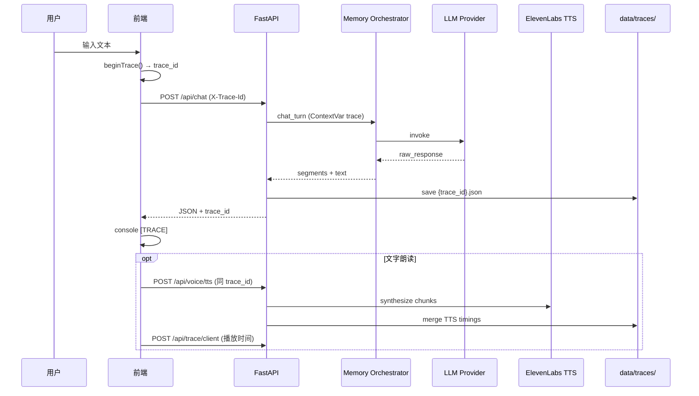

# Execution Trace 系统说明

本文档描述贾维斯 AI Agent 的 **Execution Trace** 全链路追踪：从用户输入、后端 `/api/chat`、记忆与 LLM、到前端 TTS 播放。

---

## 1. 架构概览



---

## 2. 文件与模块

| 路径 | 说明 |
|------|------|
| `neuralpal/trace/` | 核心：Recorder、ContextVar、脱敏、持久化 |
| `server/trace_routes.py` | `GET /api/trace/{id}`、`POST /api/trace/client` |
| `server/main.py` | Chat/TTS 入口绑定 trace |
| `server/voice_service.py` | TTS 分片耗时 |
| `neuralpal/memory/memory_system.py` | 记忆殿堂主路径埋点 |
| `neuralpal/llm/llm_router.py` | 基础编排器路径埋点 |
| `src/lib/executionTrace.ts` | 前端 trace_id 与 client patch |
| `src/lib/chatApi.ts` | 传递 trace_id、上报响应耗时 |
| `src/lib/voiceApi.ts` | TTS 请求与播放埋点 |
| `trace_schema.json` | JSON Schema |
| `data/traces/{trace_id}.json` | 持久化 Trace 文件 |

---

## 3. 如何打开 Trace

### 方式 A：直接读文件

```bash
cat "data/traces/<trace_id>.json" | python -m json.tool
```

### 方式 B：HTTP API（后端运行中）

```bash
curl -s "http://127.0.0.1:8766/api/trace/<trace_id>" | python -m json.tool
```

### 方式 C：测试脚本查看

```bash
python scripts/test_trace.py --trace-id <trace_id>
```

### 方式 D：浏览器 Console

发送消息后控制台会打印：

```
[TRACE] <uuid> ...
[TRACE] <uuid> response_ms=1234
```

---

## 4. 如何跑一次测试

### 单元测试（无网络）

```bash
cd "/Users/dai/Desktop/贾维斯"
python -m pytest tests/test_execution_trace.py -q
```

### 端到端（会走真实 chat_turn，需 API Key 才有 LLM 回复）

```bash
cd "/Users/dai/Desktop/贾维斯"
python scripts/test_trace.py
python scripts/test_trace.py --text "记住我喜欢喝美式"
```

### 完整 UI 路径

```bash
bash scripts/run_jarvis.sh
```

打开 `http://127.0.0.1:5190`，发一条消息，在 Console 复制 `trace_id`，再打开 `data/traces/` 对应 JSON。

---

## 5. Trace JSON 字段说明

必填顶层字段见 `trace_schema.json`。扩展字段 `pipeline` 包含：

| 字段 | 含义 |
|------|------|
| `pipeline.work_preprocess` | `schedule/work_preprocess` 快照 |
| `pipeline.agent_preprocess` | `tools/agent/preprocess` 快照（未启用则为 null） |
| `pipeline.route_classifier` | 路由分类结果 |
| `pipeline.backend_*_at` | 后端收/发时间 ISO |
| `pipeline.frontend.*` | 前端请求/响应/TTS 触发 |
| `pipeline.api_response` | 返回前端的 JSON（脱敏后） |

`memory.chroma_results` 在 Chroma 检索发生时记录 rank、score、file_path、preview。

---

## 6. 安全与脱敏

- 不记录 API Key、密码、Bearer Token
- 字段名匹配 `api_key` / `password` / `token` 等 → `[REDACTED]`
- `llm.parameters` 仅保留 temperature 等非敏感参数
- TTS 响应中 **不** 将 `audio_base64` 写入 trace（仅 HTTP 响应携带）

---

## 7. 本次改动文件清单

### 新增

- `neuralpal/trace/__init__.py`
- `neuralpal/trace/context.py`
- `neuralpal/trace/recorder.py`
- `neuralpal/trace/sanitize.py`
- `neuralpal/trace/storage.py`
- `neuralpal/trace/messages.py`
- `neuralpal/trace/llm_meta.py`
- `server/trace_routes.py`
- `src/lib/executionTrace.ts`
- `trace_schema.json`
- `TRACE_REPORT.md`
- `scripts/test_trace.py`
- `tests/test_execution_trace.py`
- `data/traces/.gitkeep`

### 修改

- `server/main.py` — Chat/TTS trace 绑定、`trace_id` 响应
- `server/voice_service.py` — TTS 分片 `request_ms`
- `neuralpal/memory/memory_system.py` — 主路径埋点
- `neuralpal/llm/llm_router.py` — 基础编排器埋点
- `src/lib/chatApi.ts`
- `src/lib/voiceApi.ts`
- `src/hooks/useChat.ts`
- `src/hooks/useReadAloud.ts`

---

## 8. 当前项目最慢的 3 个环节（典型生产请求）

基于默认 **Memory Palace + Doubao Pro** 路径的架构分析（实际数值以各 trace 的 `timings` 为准）：

| 排名 | 环节 | `timings` 键 | 典型原因 |
|------|------|----------------|----------|
| 1 | **主模型生成** | `llm_ms` | 单次非流式 `invoke`，等待完整 completion |
| 2 | **合规审查** | `compliance_ms` | 额外 Lite 模型多轮 JSON 审查/重写 |
| 3 | **记忆检索** | `memory_ms` | Chroma 向量检索 + knowledge_palace 读盘 |

次要瓶颈：`route_ms`（Lite 路由分类）、`tts_total_ms`（ElevenLabs 按 chunk 串行合成）。

---

## 9. 下一步优化建议

1. **LLM 流式 + 分段合规**：先流式输出用户可见段，合规并行审查，降低首字延迟与 `llm_ms` 感知耗时。
2. **合规短路**：对低风险闲聊路由缓存审查结果或单轮轻量规则，减少 `compliance_ms`。
3. **记忆检索并行化**：Chroma 搜索与短期历史组装、`work_preprocess` 并行，压缩 `memory_ms` + `preprocess_ms`。
4. **TTS 并行合成**：多 chunk 使用 `asyncio.gather` 预取下一段，缩短 `tts_total_ms`。
5. **Trace 可观测平台**：将 `data/traces/` 汇总为按 `session_id` / `character_id` 的仪表盘（P50/P95 各环节耗时）。

---

## 10. 故障排查

| 现象 | 处理 |
|------|------|
| 无 trace 文件 | 确认 `data/traces/` 可写；查看后端日志 `[TRACE]` |
| `llm_ms=0` | 可能在 `work_preprocess` 直接回复短路，或 API Key 未配置提前返回 |
| 前端无 TTS 段 | 未开启「文字朗读」或未调用 `/api/voice/tts` |
| `chroma_results=[]` | 寒暄门控跳过检索，或 Chroma 库为空 |

---

*生成时间：2026-06-20 · Jarvis Execution Trace v1*
