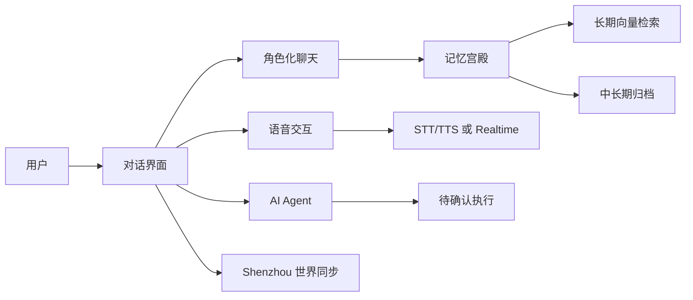

# 02_PRODUCT

## 贾维斯，不只是聊天框

一个同时具备“人格化对话、长期记忆、语音交互、电脑代办、生活上下文同步”的 AI 产品。

---

## 为什么用户会需要它

普通 AI 常见问题：

- 每次都像第一次见你
- 会回答，但不持续理解你
- 语音、记忆、行动能力彼此割裂

贾维斯的产品思路是：把“会聊、会记、会说、会做”放到同一个持续会话里。

---

## 它可以帮用户做什么

### 1) 持续对话，而不是一次性问答

- 以角色“沈昼”为默认人格，支持稳定语气和互动风格
- 普通用户首次登录后可创建自己的 AI 人物（名称、风格、API Key）

### 2) 把聊天沉淀成可复用记忆

- 短期记忆：当前会话连续上下文
- 中期记忆：日/周/月汇总
- 长期记忆：知识宫殿文件 + 向量检索（Chroma）

### 3) 支持两类语音体验

- 传统链路：STT -> LLM -> TTS
- 实时链路：OpenAI Realtime WebRTC 低延迟语音

### 4) 不止回答，还能发起可控执行

- AI Agent 先给“待执行方案”
- 用户确认后才执行
- 支持取消、重试、状态查询、会话级 pending 持久化

---

## 为什么和普通 AI 不同

### “关系系统”是产品内核，而不是附加插件

- 内置 Trust Points（亲密度）分级
- 对话风格会随关系阶段变化
- 工作模式（上班/陪伴/加班）影响工具可用性与回复策略

### “世界上下文”能力可接入外部现实

- 可与 Shenzhou 世界引擎同步用户日数据
- 可拉取 life context，支持事件触发主动消息
- 支持日/周/月/年上下文归档

---

## 核心亮点（图文化）

### 产品能力地图



### 体验闭环

```text
输入（文字/语音） -> 理解（路由+记忆） -> 回答（人格化输出）
-> 行动（可确认代办） -> 沉淀（记忆/归档） -> 下一次更懂你
```

---

## 当前可交付体验状态

- 核心对话体验：【已完成】
- 记忆持续性体验：【已完成】
- 语音体验（传统 + Realtime）：【已完成】
- 代办执行体验（确认门控）：【已完成】
- 世界引擎联动体验：【已完成】但【无前端统一入口】
- 话题雷达体验：【开发中】
- 插件化提醒体验：【开发中】

