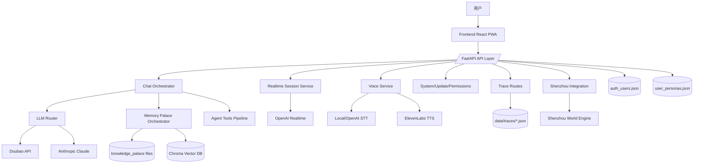
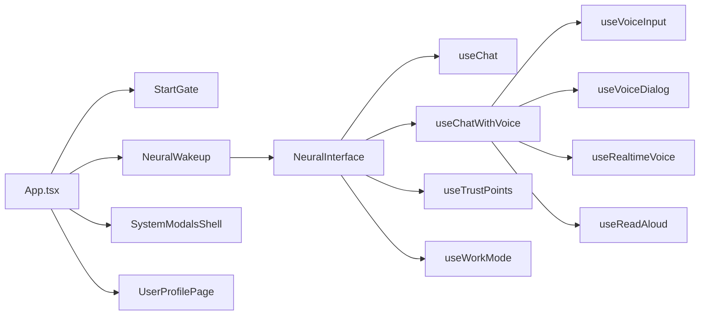
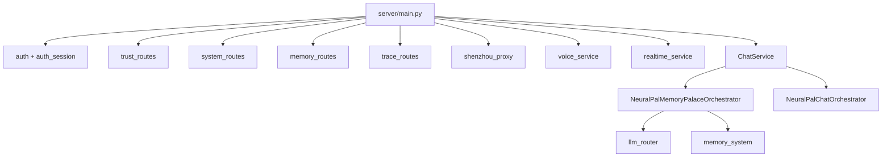
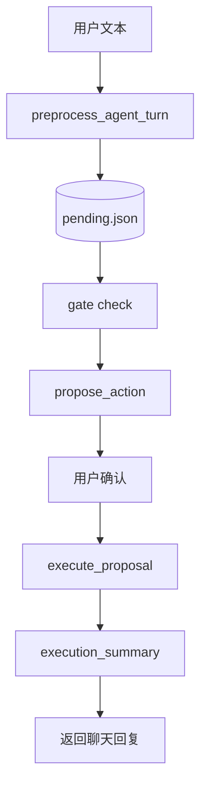
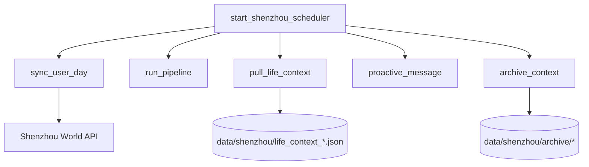

# 08_ARCHITECTURE

## 总体架构



---

## 前端架构（用户可见层）



关键说明：

- 前端通过 `authSession` 在 `sessionStorage` 保存访问令牌
- 前端 API 调用大多统一走 `/api/*`
- PWA 安装/更新与系统权限通过 `SystemModalsShell` 统一管理

---

## 后端架构（服务层）



---

## 记忆与数据架构

### 记忆层次

1. 规则层：`core_rules.py` + 角色规则文件  
2. 长期记忆：`knowledge_palace` 文件 + Chroma 索引  
3. 短期记忆：会话内消息与滚动摘要  
4. 瞬时记忆：当前轮临时上下文

### 数据存储形态

- 认证与用户：JSON 文件
- 角色与规则：JSON + Markdown
- Trace：JSON 文件
- 向量检索：Chroma（含 sqlite 与二进制索引）
- 归档：按日/周/月/年的 Markdown/JSON 文件

---

## 语音架构

```mermaid
flowchart LR
    Mic[麦克风] --> STTAPI[/api/voice/stt]
    STTAPI --> STTCore[SttAdapter]
    STTCore --> Txt[文本]
    Txt --> Chat[/api/chat]
    Chat --> Reply[回复文本]
    Reply --> TTSAPI[/api/voice/tts]
    TTSAPI --> Eleven[ElevenLabs]
    Eleven --> Audio[播放音频]
```

Realtime 分支：

```mermaid
flowchart LR
    FE[useRealtimeVoice] --> SESS[/api/realtime/session]
    SESS --> Secret[ephemeral client secret]
    Secret --> WebRTC[OpenAI Realtime WebRTC]
    WebRTC --> FE
```

---

## Agent 架构



特点：

- 强制确认门控（高风险默认需确认）
- 状态持久化（awaiting_confirm/running/completed/failed）
- 取消与重试链路完整

---

## Shenzhou 集成架构



---

## 架构状态结论

- 主干链路（聊天/记忆/语音/Agent）：【已完成】
- 外部世界同步（Shenzhou）：【已完成】但前端入口不足
- Topic Radar：【开发中】（关键 service 缺失）
- Reminder 插件：【开发中】（占位实现）

