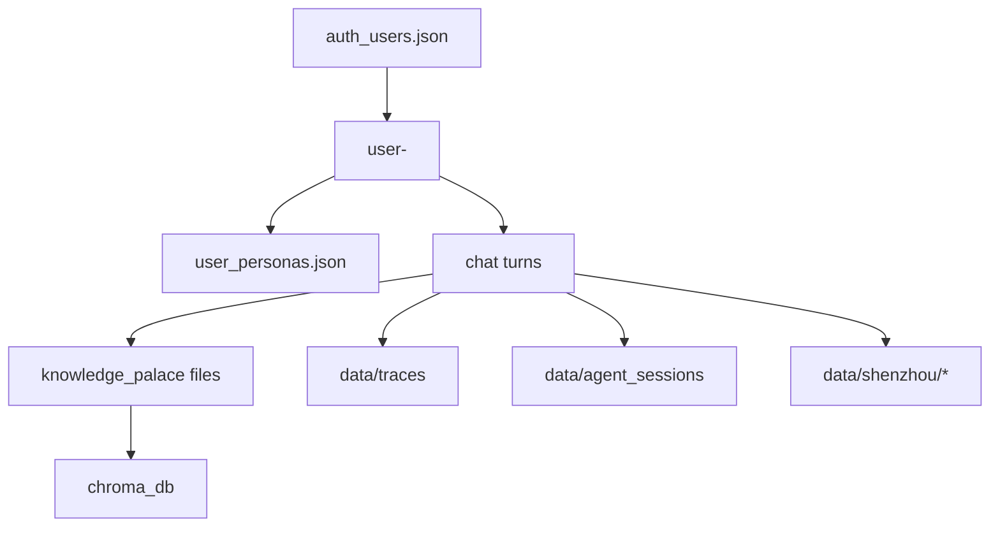

# 10_DATABASE

> 本项目并非传统单一关系型数据库架构。  
> 数据由 **JSON/Markdown 文件 + Chroma 向量库（sqlite + bin）** 共同组成。  
> 下表按“逻辑表”方式整理字段、用途、关系与生命周期。

## 1) 身份与会话域

### `data/auth_users.json`（逻辑表：users）

- 字段：`username`, `password`, `role`
- 用途：本地普通用户账号存储
- 关系：与 `session_id_for_username(username)` 映射会话
- 生命周期：注册时新增；手工编辑或脚本维护
- 状态：`【已完成】`
- 风险：密码明文存储（上线前应改造）

### `sessionStorage: jarvis-auth`（前端会话）

- 字段：`username`, `loggedInAt`, `role`, `isAdmin`, `accessToken`
- 用途：前端持有登录态
- 关系：请求头 `Authorization: Bearer ...`
- 生命周期：登录写入，退出清除，浏览器会话级
- 状态：`【已完成】`

---

## 2) 角色与规则域

### `data/characters/characters.json`（逻辑表：characters）

- 字段：`id`, `name`, `user_mbti`, `ai_type`, `personality_description`, 调优参数等
- 用途：角色主档
- 关系：被 `session_bindings.json`、聊天接口、信任系统引用
- 生命周期：初始化创建，后续可更新
- 状态：`【已完成】`

### `data/characters/session_bindings.json`（逻辑表：session_bindings）

- 字段：`session_id -> { character_id, activated_at }`
- 用途：会话绑定角色
- 关系：连接会话与角色
- 生命周期：角色激活或绑定变更时写入
- 状态：`【已完成】`

### `data/characters/<角色>/rules/trust_system.json`（逻辑表：trust_rules）

- 字段：`range`, `levels`, `scoring`, `permission_locks`, `reply_style_files` 等
- 用途：信任度规则与权限分层
- 关系：驱动 `trust_state.json` 与聊天风格策略
- 生命周期：规则配置文件，低频修改
- 状态：`【已完成】`

### `data/characters/<角色>/rules/trust_state.json`（逻辑表：trust_state）

- 字段：`trust_points`, `level`, `level_name`, `score_log[]`, `updated_at`
- 用途：当前信任状态与审计记录
- 关系：由 `/api/trust`、`/api/admin/trust` 读写
- 生命周期：会话中动态更新
- 状态：`【已完成】`

### `data/characters/<角色>/rules/work_schedule.json`（逻辑表：work_schedule）

- 字段：`work_weekdays`, `work_start`, `work_end`, `overtime_tp_cost` 等
- 用途：工作模式计算
- 关系：`/api/system/work-mode` 与 Agent 门控相关
- 生命周期：配置型，低频修改
- 状态：`【已完成】`

---

## 3) Persona 与用户个性化域

### `data/user_personas.json`（逻辑表：user_personas）

- 字段：`display_name`, `style_prompt`, `chatgpt_api_key`, `claude_api_key`, `deepseek_api_key`, `doubao_api_key`, `updated_at`
- 用途：普通用户自定义角色
- 关系：`/api/user/persona`，聊天时注入 runtime_user
- 生命周期：首次创建后可更新
- 状态：`【已完成】`
- 备注：用户 key 已保存，但多租户路由接线仍有提升空间

---

## 4) 记忆与归档域

### `data/characters/<角色>/knowledge_palace/*`（逻辑表：memory_documents）

- 字段（文档元）：`rel_path`, `tier`, `title`, `preview`, `category`, `marked`, `modified_at`
- 用途：短/中/长期记忆主存储
- 关系：与 Chroma 向量索引双写
- 生命周期：
  - 短期：会话中高频写入
  - 中期：日/周/月汇总生成
  - 长期：归档沉淀与召回
- 状态：`【已完成】`

### `data/characters/<角色>/knowledge_palace/.memory_maintenance_state.json`

- 字段：维护游标、各周期处理状态
- 用途：维护任务幂等与进度跟踪
- 关系：`memory_maintenance.py`
- 生命周期：后台维护周期更新
- 状态：`【已完成】`

### Chroma 向量库（`data/characters/<角色>/chroma_db/*`）

- 结构：`chroma.sqlite3` + 二进制索引文件
- 用途：长期记忆语义检索
- 关系：与 `knowledge_palace` 文本文件元信息关联
- 生命周期：长期存在，可重建索引
- 状态：`【已完成】`

---

## 5) Agent 与执行状态域

### `data/agent_sessions/*_pending.json`（逻辑表：agent_pending）

- 字段：`task_id`, `goal`, `status`, `pending_action`, `execution_summary`, `error`, `expires_at`
- 用途：待确认与执行中任务持久化
- 关系：`/api/agent/pending|confirm|cancel`
- 生命周期：任务创建->确认->完成/失败/取消后清理或保留摘要
- 状态：`【已完成】`

### `data/agent_sessions/*_overtime.json`（逻辑表：overtime_state）

- 字段：`deferred_task`, `awaiting_consent`, `active_until`, `tp_cost` 等
- 用途：非工作时间加班状态跟踪
- 关系：工作模式与 Agent 执行门控
- 生命周期：随会话与时间窗口变化
- 状态：`【已完成】`

---

## 6) Trace 与可观测域

### `data/traces/*.json`（逻辑表：execution_traces）

- 字段：参见 `trace_schema.json`
- 用途：记录每次对话链路（timings、prompt、memory、llm、tts、errors）
- 关系：`/api/chat` 创建；`/api/trace/client` 追加
- 生命周期：长期保留（按运维策略可归档/清理）
- 状态：`【已完成】`

### `trace_schema.json`

- 用途：定义 trace 结构标准
- 关系：约束 trace 读写与分析
- 生命周期：随版本演进
- 状态：`【已完成】`

---

## 7) Shenzhou 上下文域

### `data/shenzhou/life_context_YYYY-MM-DD.json`

- 用途：每日生活上下文缓存
- 关系：`/api/shenzhou/pull-life-context`、聊天上下文注入
- 生命周期：按天写入，后续可归档压缩
- 状态：`【已完成】`

### `data/shenzhou/event_sync_YYYY-MM-DD.json`

- 用途：事件同步摘要
- 关系：shenzhou sync/pipeline
- 生命周期：按天写入
- 状态：`【已完成】`

### `data/shenzhou/.life_context_archive_state.json` 与 `data/shenzhou/archive/*`

- 用途：归档状态 + 周/月/年汇总
- 关系：`/api/shenzhou/archive-context` 与 scheduler
- 生命周期：周期性归档
- 状态：`【已完成】`

---

## 8) 预留/规划数据域

### `data/topic_radar.db`（配置预期）

- 用途：Topic Radar 话题雷达持久化目标库
- 状态：`【开发中】`
- 说明：配置与模型已存在，关键服务链路未完整落地

### `data/companion_life.db`、`data/companion_life_chroma`（配置预期）

- 用途：Companion Life 的结构化数据与向量数据
- 状态：`【开发中】`
- 说明：部分桥接能力存在，仍有 TODO 接线项

---

## 数据关系总览（简化）

